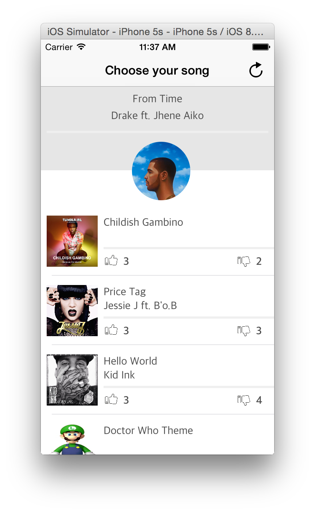
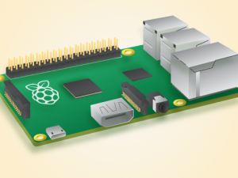

SoundPoll
========

To participate in an event, a meetup, even in a party, and to have the possibility of choosing the song which will pass in a few moments with a mobile application, a raspberry and loudspeakers, it was what realized, or almost during the [fHacktory](https://www.linkedin.com/company/3299824?trk=prof-exp-company-name). 

An application that not only do its job, but before everything an app that let people having good time together.

## Issues

- The display of the current music changes before it ends.
- After refresh actions, it seems the cover images downloaded aren't ordered well.

## Credits

- The author of the iOS app : Aymen Rebouh [@aymenworks](http://twitter.com/aymenworks).

- The author of the server side, the perso who suggested this cool idea and the one who plays with the raspberry : Gustave Monod [@GusMonod](https://github.com/GusMonod).
- Thanks to [@fHacktory](https://github.com/fhacktory) to have organized this event.

## Licence

SoundPoll is available under the MIT license.

Copyright © 2015 Aymen Rebouh & Gustave Monod.

Permission is hereby granted, free of charge, to any person obtaining a copy of this software and associated documentation files (the "Software"), to deal in the Software without restriction, including without limitation the rights to use, copy, modify, merge, publish, distribute, sublicense, and/or sell copies of the Software, and to permit persons to whom the Software is furnished to do so, subject to the following conditions:

The above copyright notice and this permission notice shall be included in all copies or substantial portions of the Software.

THE SOFTWARE IS PROVIDED "AS IS", WITHOUT WARRANTY OF ANY KIND, EXPRESS OR IMPLIED, INCLUDING BUT NOT LIMITED TO THE WARRANTIES OF MERCHANTABILITY, FITNESS FOR A PARTICULAR PURPOSE AND NONINFRINGEMENT. IN NO EVENT SHALL THE AUTHORS OR COPYRIGHT HOLDERS BE LIABLE FOR ANY CLAIM, DAMAGES OR OTHER LIABILITY, WHETHER IN AN ACTION OF CONTRACT, TORT OR OTHERWISE, ARISING FROM, OUT OF OR IN CONNECTION WITH THE SOFTWARE OR THE USE OR OTHER DEALINGS IN THE SOFTWARE.
